# 1.1 - Web Programming Conecpts, Including: Authentication, Web Security
## Authentication
Website authentication is the security process that allows users to verify their identities in order to gain access to their personal accounts on a website. This process occurs behind the scenes any time an individual logs into an online account, including social media profiles, eCommerce sites, rewards programs, online banking accounts, and more.

 

Website authentication practices often include the creation of an ID and key.

When a user creates a new account on a website, they create a unique ID and key that will be used in the future to verify their identity and allow them back into the account. That ID and key are then stored in a highly secure web server to compare future credentials against. The idea is that the user is the only one who has access to their ID and key, thus ensuring they’re the only one able to enter the account.

 

IDs and keys can come in all shapes and sizes, creating login processes that range from “basically open for an attack” to “entirely safe and secure.” The most common type of website authentication identification, however, is still that of the traditional username and password as the ID and key.  At the same time, traditional username and password schemes have increasingly become vulnerable to cyber-attacks.

 

To help improve security a new technology was developed, this was two-factor authentication; Two-factor authentication (2FA) is a security practice that requires users of your website to provide, along with their standard username and password, an additional form of authentication to log in. The two most common methods involve authentication through an SMS message, or a one-time code generated via an application on a user’s mobile phone. More advanced methods such as using a biometric information, location through GPS, or a hardware token are also possible.

Two-factor authentication is a helpful security practice because it prevents attackers from compromising accounts by requiring an extra authentication method beyond only using a password to log in. This is important because standard password access can be easy to bypass if the user has a simple password that's easy to guess, is observed typing in their password, or has used their password on another site that becomes compromised. By requiring a second form of authentication (especially one tied to a physical device like a mobile phone or a USB key), would-be attackers not only have to compromise a user’s password, but also their mobile phone or physical USB key, which makes the attack much more difficult.

Video 1 - https://youtu.be/0mvCeNsTa1g(opens in a new tab) (2m)

Video 2 - https://youtu.be/STI6vtKtHpU(opens in a new tab) (5m)

## Web Security
Web security is an umbrella term that encompasses the protection of websites using methods like encryption to ensure data is protected as it travels between the client and the server.

 

Website security is the measures taken to secure a website from cyberattacks. In this sense, website security is an ongoing process and an essential part of managing a website. Website security is important because nobody wants to have a hacked website. Having a secure website is as vital to someone’s online presence as having a website host. If a website is hacked and block listed, for example, it loses up to 98% of its traffic. Not having a secure website can be as bad as not having a website at all or even worse. For example, client data breach can result in lawsuits, heavy fines, and ruined reputation.

To be effective when dealing with cyberattacks a company needs to be proactive in its approach, there have been many record cases of companies fixing issues after something has gone wrong, items such loss of client and business data are normally signs of poorly maintained systems.

 

When working on cybersecurity there are two terms that appear quite a lot, authentication, and authorisation. Let us define them:

- Authentication: Verifying that a person is (or at least appears to be) a specific user, since he/she has correctly provided their security credentials (password, answers to security questions, fingerprint scan, etc.).
- Authorisation: Confirming that a particular user has access to a specific resource or is granted permission to perform a particular action.
 

To break that down to an easy-to-understand analogy, you use authentication to access your phone, i.e., fingerprint, pin code, password. Authorisation allows you to say who has access to your phone.

[https://youtu.be/inWWhr5tnEA(opens in a new tab) (7m)](https://youtu.be/inWWhr5tnEA)

## Code an Example of Authentication and Authorisation
Download and install Xampp ( https://www.apachefriends.org/download.html(opens in a new tab) )

If you are on windows, modify the xampp0control.ini file and allow the everyone account full control.

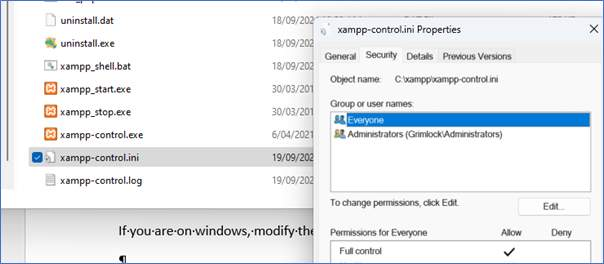

Once this is done, double click the camp-control.exe and start up the Apache aspect of the system.
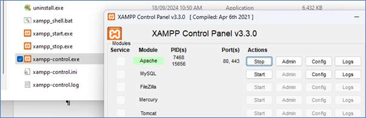

Next, ensure you have an empty htdocs folder, as such:

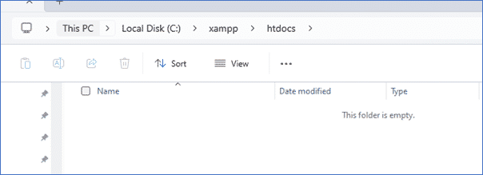

> From here, open up VSCode ( https://code.visualstudio.com/(opens in a new tab) ), then run through the file->open folder section and locate you htdocs folder. You should see the following: 
> 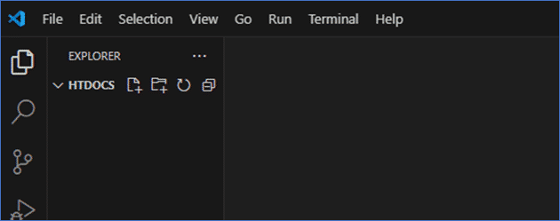

From here we are going to make some php pages, the first page will be index.php. And add the following:

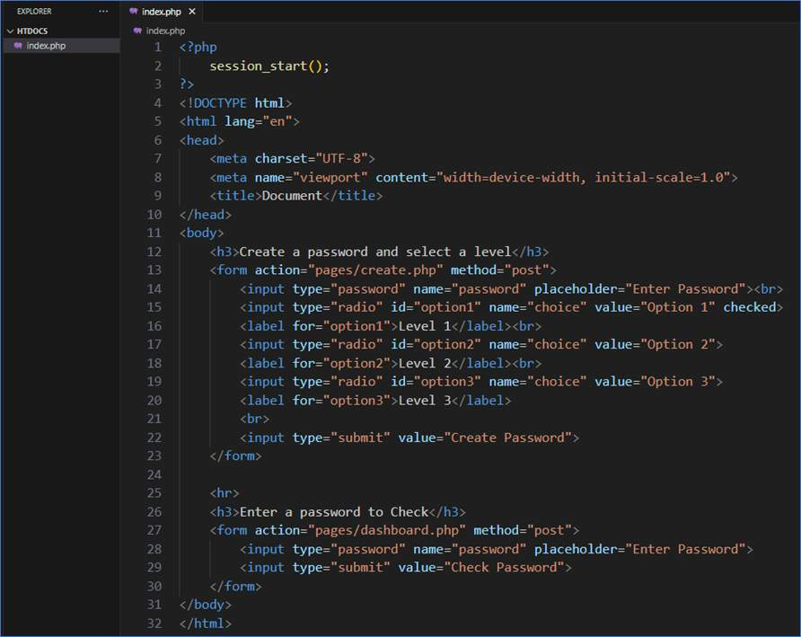

> If you save this and go to localhost(opens in a new tab), you will see the following:
> 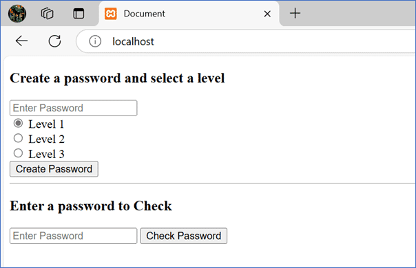

Next, we will make the create.php page, make the following changes by creating a folder called pages to put in all pages other than index.php. Then create the create.php file with the following code:

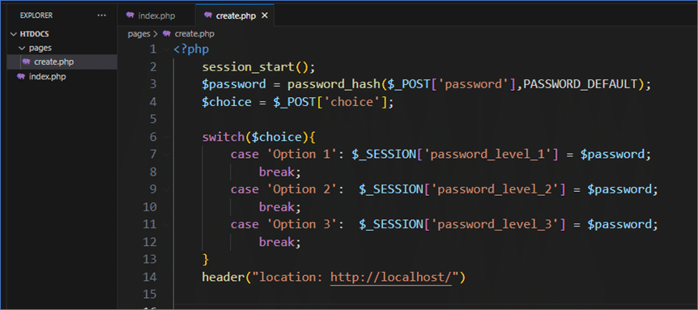

From here, if we test it (use the word password), the index page will just empty the form after we click on create password. As such, we will add a piece of code to the index page, to see that something has happened. Make the following modifications to index.php:

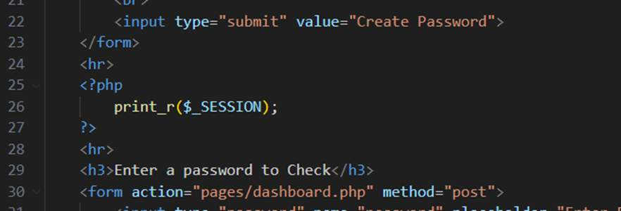

> Refresh the page and you will see:
> 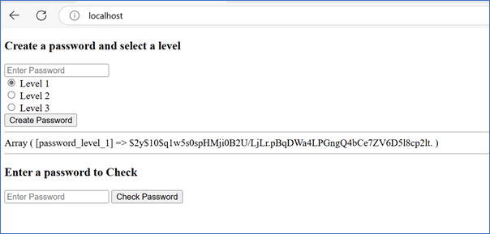

Next create password2 as level 2 and password3 as level 3, this should give you something similar to the following:

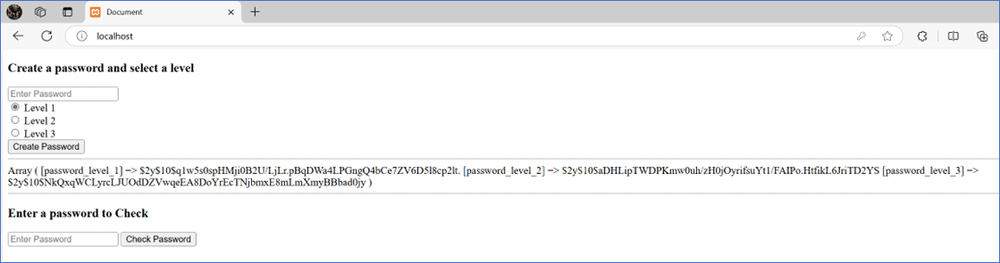

From here we have 3 session variables that contain different passwords. From here, we will create the dashboard.php that will display the level of authorisation that the password allows, but only after it has been authenticated.

Create the dashboard.php page in the pages folder and write the following code:

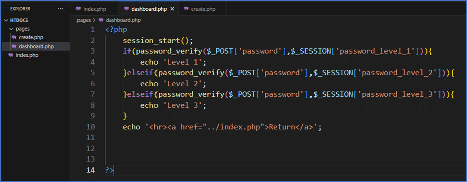

From here, make sure all pages are saved, then test with the passwords of:

- password

- password2

- password3

You should see the following:

| password      | password2     | password3     |
| ------------- | ------------- | ------------- |
| 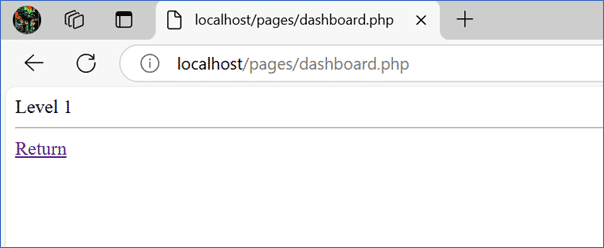 | 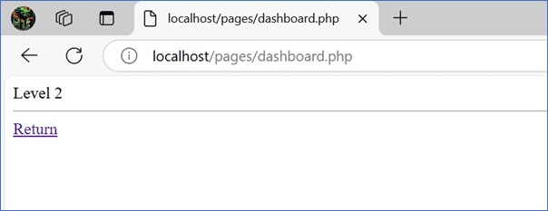 | 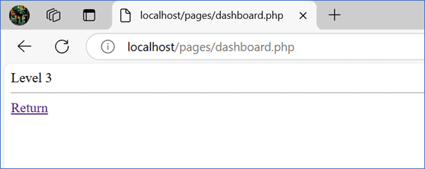 |

> And if you test with the incorrect password, you will get this screen:
> 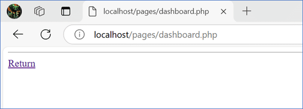

This little piece of code shows authentication in action, you need to have the correct password to see output on the dashboard page and authorisation, the password used provides access to different output, so a level 1 password only shows the words level 1, an incorrect password shows nothing.
